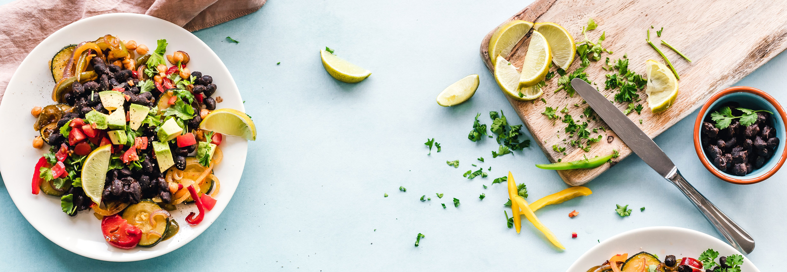

# 🍽️ FOOD Scan - AI-Powered Recipe Generator

<div align="center">



**Transform any food image into a complete recipe with the power of AI**

[](https://python.org)
[](https://flask.palletsprojects.com/)
[](https://pytorch.org/)
[](LICENSE)
[]()

[🚀 Live Demo](#-quick-start) • [📖 Documentation](#-features) • [🛠️ Installation](#-installation) • [🤝 Contributing](#-contributing)

</div>

---

## 🌟 Overview

**FOOD Scan** is an innovative AI-powered web application that analyzes food images and generates complete recipes with ingredients and step-by-step cooking instructions. Using advanced deep learning models, it can identify dishes and provide detailed culinary guidance in seconds.

### ✨ Key Highlights

- 🤖 **AI-Powered Analysis**: Advanced computer vision models for accurate food recognition
- 📱 **Modern UI/UX**: Beautiful, responsive interface built with Tailwind CSS
- ⚡ **Fast Processing**: Recipe generation in 30-40 seconds
- 🎯 **Dual Recipes**: Get two different recipe variations for each image
- 📸 **Multiple Input Methods**: Upload images or try sample photos
- 🎨 **Professional Design**: Glassmorphism effects and smooth animations

---

## 🎯 Features

### 🔍 **Smart Food Recognition**
- Upload any food image (JPG, PNG, WebP)
- AI identifies the dish automatically
- Supports various cuisines and cooking styles

### 📋 **Complete Recipe Generation**
- **Recipe Name**: AI-generated dish titles
- **Ingredients List**: Comprehensive ingredient breakdown
- **Cooking Instructions**: Step-by-step cooking guide
- **Dual Options**: Two recipe variations per image

### 🎨 **Modern Interface**
- **Responsive Design**: Works on desktop, tablet, and mobile
- **Drag & Drop**: Easy file upload with visual feedback
- **Sample Images**: Try the app with pre-loaded examples
- **Real-time Processing**: Live status updates during analysis
- **Print & Share**: Export recipes or share with friends

### 🛡️ **Robust Architecture**
- **Error Handling**: Graceful error management
- **File Validation**: Secure file upload with size limits
- **Performance Optimized**: Efficient model loading and processing
- **Cross-Platform**: Compatible with Windows, macOS, and Linux

---

## 🛠️ Installation

### Prerequisites

- **Python 3.11+** 
- **pip** (Python package manager)
- **Git** (for cloning the repository)

### 📦 Quick Setup

1. **Clone the Repository**
   ```bash
   git clone https://github.com/yourusername/food-scan.git
   cd food-scan
   ```

2. **Create Virtual Environment** (Recommended)
   ```bash
   python -m venv venv
   
   # Windows
   venv\Scripts\activate
   
   # macOS/Linux
   source venv/bin/activate
   ```

3. **Install Dependencies**
   ```bash
   pip install -r requirements.txt
   ```

4. **Download AI Models** (Automatic on first run)
   - Models will be downloaded automatically when you first run the application
   - Total size: ~396MB
   - Ensure stable internet connection for initial setup

---

## 🚀 Quick Start

### Running the Application

1. **Start the Flask Server**
   ```bash
   python run.py
   ```

2. **Open Your Browser**
   ```
   http://127.0.0.1:5000
   ```

3. **Upload a Food Image**
   - Drag and drop an image or click "Choose Food Image"
   - Or try one of the sample images
   - Wait 30-40 seconds for AI processing

4. **Get Your Recipe!**
   - View generated recipe name, ingredients, and instructions
   - Switch between two recipe options using tabs
   - Print or share your recipe

### 📱 Usage Tips

- **Best Results**: Use clear, well-lit food images
- **File Formats**: JPG, PNG, WebP supported
- **File Size**: Maximum 10MB per image
- **Processing Time**: Typically 30-40 seconds
- **Multiple Recipes**: Check both tabs for different variations

---

## 🏗️ Project Structure

```
food-scan/
├── 📁 Foodimg2Ing/           # Main application package
│   ├── 📁 static/            # Static assets
│   │   ├── 📁 images/        # Images and favicon
│   │   └── 📄 main.js        # Frontend JavaScript
│   ├── 📁 Templates/         # HTML templates
│   │   ├── 📄 header.html    # Base template with navigation
│   │   ├── 📄 layout.html    # Main layout with upload section
│   │   ├── 📄 home.html      # Homepage content
│   │   ├── 📄 about.html     # About page
│   │   └── 📄 predict.html   # Recipe results page
│   ├── 📁 models/            # AI model files (auto-downloaded)
│   ├── 📄 __init__.py        # Flask app initialization
│   ├── 📄 routes.py          # URL routes and handlers
│   └── 📄 output.py          # AI model processing
├── 📄 run.py                 # Application entry point
├── 📄 requirements.txt       # Python dependencies
├── 📄 .gitignore            # Git ignore rules
└── 📄 README.md             # This file
```

---

## 🧠 Technology Stack

### **Backend**
- **Flask 2.3.3** - Web framework
- **PyTorch 2.1.0** - Deep learning framework
- **Pillow 10.0.1** - Image processing
- **NumPy 1.24.3** - Numerical computing

### **Frontend**
- **Tailwind CSS** - Utility-first CSS framework
- **Alpine.js** - Lightweight JavaScript framework
- **Lucide Icons** - Beautiful icon library
- **Custom JavaScript** - Enhanced interactivity

### **AI Models**
- **Computer Vision Models** - Food image recognition
- **Natural Language Processing** - Recipe text generation
- **Pre-trained Networks** - Transfer learning for accuracy

---

## 🎨 Design Features

### **Visual Design**
- **Glassmorphism Effects** - Modern frosted glass appearance
- **Gradient Backgrounds** - Beautiful color transitions
- **Responsive Layout** - Adapts to all screen sizes
- **Custom Animations** - Smooth transitions and effects

### **User Experience**
- **Drag & Drop Upload** - Intuitive file handling
- **Real-time Feedback** - Loading states and progress indicators
- **Error Handling** - User-friendly error messages
- **Accessibility** - Screen reader compatible

---

## 📊 Performance

- **Model Loading**: ~5-10 seconds (first run only)
- **Image Processing**: 30-40 seconds average
- **Memory Usage**: ~2-3GB during processing
- **File Size Limit**: 10MB maximum
- **Supported Formats**: JPG, PNG, WebP

---

## 🔧 Configuration

### **Environment Variables**
```bash
# Optional: Set custom port
export PORT=5000

# Optional: Enable debug mode
export FLASK_DEBUG=1
```

### **Model Configuration**
- Models are automatically downloaded to `Foodimg2Ing/models/`
- Total model size: ~396MB
- Models are cached after first download

---

## 🚀 Deployment

### **Local Development**
```bash
python run.py
```

### **Production Deployment**
```bash
# Using Gunicorn
gunicorn -w 4 -b 0.0.0.0:8000 run:app

# Using Docker (if Dockerfile exists)
docker build -t food-scan .
docker run -p 5000:5000 food-scan
```

---

## 🤝 Contributing

We welcome contributions! Here's how you can help:

### **Ways to Contribute**
- 🐛 Report bugs and issues
- 💡 Suggest new features
- 🔧 Submit pull requests
- 📖 Improve documentation
- 🎨 Enhance UI/UX design

### **Development Setup**
1. Fork the repository
2. Create a feature branch: `git checkout -b feature-name`
3. Make your changes
4. Test thoroughly
5. Submit a pull request

---

## 📝 License

This project is licensed under the MIT License - see the [LICENSE](LICENSE) file for details.

---

## 🙏 Acknowledgments

- **PyTorch Team** - For the amazing deep learning framework
- **Flask Community** - For the excellent web framework
- **Tailwind CSS** - For the beautiful styling system
- **Open Source Community** - For inspiration and resources

---

## 📞 Support

### **Getting Help**
- 📧 **Email**: your-email@example.com
- 🐛 **Issues**: [GitHub Issues](https://github.com/yourusername/food-scan/issues)
- 💬 **Discussions**: [GitHub Discussions](https://github.com/yourusername/food-scan/discussions)

### **FAQ**

**Q: Why is the first run slow?**
A: The AI models need to be downloaded (396MB total). Subsequent runs are much faster.

**Q: What image formats are supported?**
A: JPG, PNG, and WebP formats up to 10MB in size.

**Q: Can I run this offline?**
A: Yes, after the initial model download, the app works completely offline.

**Q: How accurate are the recipes?**
A: The AI provides good starting points, but recipes may need adjustment based on personal taste.

---

<div align="center">

**Made with ❤️ and 🤖 AI**

⭐ **Star this repo if you found it helpful!** ⭐

[🔝 Back to Top](#-food-scan---ai-powered-recipe-generator)

</div>
